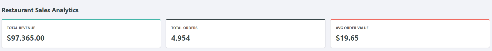
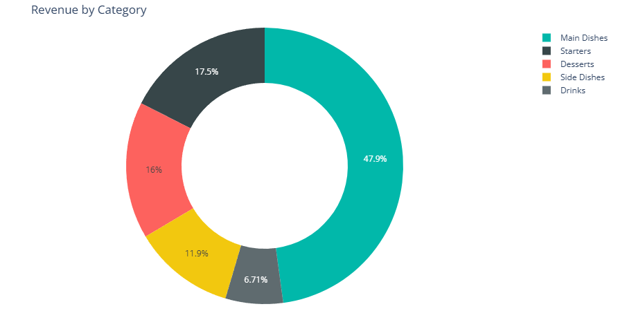
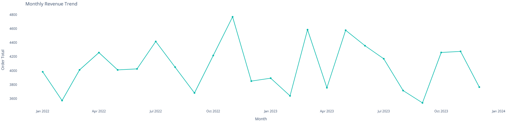
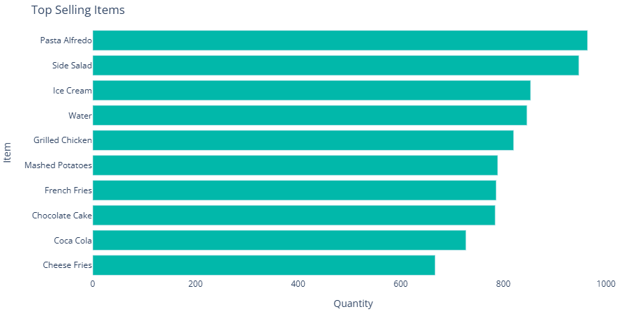
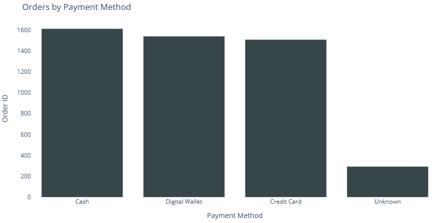
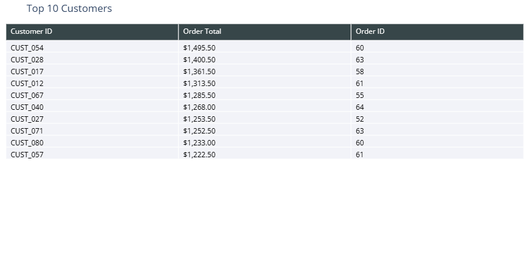

# Restaurant Sales Data Cleaning and Interactive Dashboard Analytics

An advanced data engineering and analytics implementation focused on transforming raw, unstructured sales data into a production-ready dataset and a dynamic business intelligence dashboard. This project demonstrates the full data lifecycle: from data cleaning and imputation using Python, to visual analytical reporting using Plotly and HTML.

---

## Case Study Overview

This system is designed to clean, process, and analyze the operational sales data of a restaurant. The system processes a raw dataset containing nearly 5,000 records of customer orders, resolving critical data quality issues to extract actionable business metrics.

* **Data Cleaning:** Duplicates are removed, data types are strictly enforced, and missing financial values (Price, Quantity, Order Total) are mathematically reconstructed.
* **Statistical Imputation:** The pipeline intelligently fills missing categorical data (like Items and Payment Methods) using localized statistical modes to prevent data bias.
* **Interactive Visualization:** The output is a standalone HTML dashboard that dynamically visualizes revenue trends, top-selling items, and customer behavior.

---

## Executive Summary & Core KPIs
To demonstrate the data analytics capabilities, several advanced business intelligence metrics were calculated. Below are the core Key Performance Indicators (KPIs) summarizing the restaurant's overall performance:

---

## Analytical Insights and Core Visualizations

The dashboard was built using Plotly to provide interactive, deep-dive insights into the restaurant's operations. Below are the key visual metrics extracted from the cleaned data:

### 1. Revenue by Category
A breakdown of how different menu categories (Main Dishes, Starters, Desserts, etc.) contribute to the total revenue.

### 2. Monthly Revenue Trend
A time-series analysis monitoring the trajectory of total operational revenue over time to capture seasonality.

### 3. Top Selling Items
Evaluating menu performance by quantity sold, highlighting the highest-demand items.

### 4. Orders by Payment Method
Visualizing transaction metrics across Cash, Digital Wallets, and Credit Cards to optimize operational cash flow.

### 5. Top 10 Valued Customers
Tracking the most valuable customers by order volume and total revenue generated.

---

## Project Architecture and Deployment

The repository contains the following files structured for clean execution:

1. **`sales_data_processing.ipynb`** : Complete Python processing script featuring Pandas and Plotly architecture.
2. **`restaurant_sales_cleaned.xlsx`** : The final production-ready cleaned dataset.
3. **`dashboard.html`** : The programmatic HTML dashboard layout.

**To Run:** Open the `dashboard.html` file in any modern web browser (Chrome, Edge, Safari) to interact with the visualizations. To view the data engineering process, open the `.ipynb` file in Jupyter Notebook or Google Colab.
